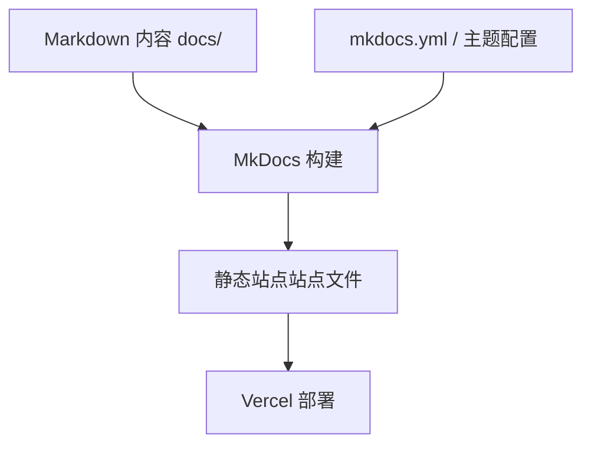
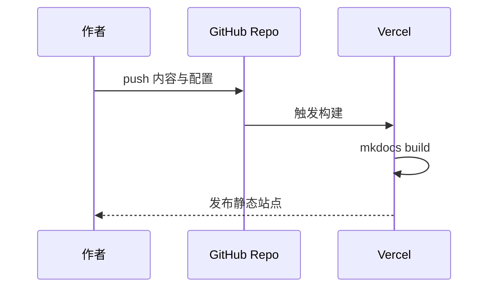

# 架构设计

## 总体架构

## 技术栈
- **站点生成:** MkDocs + Material for MkDocs
- **内容:** Markdown
- **部署:** GitHub + Vercel

## 核心流程

## 重大架构决策

| adr_id | title | date | status | affected_modules | details |
|--------|-------|------|--------|------------------|---------|
| ADR-001 | 以 MkDocs Material 实现博客样式首页与标签体系 | 2026-01-28 | ✅已采纳 | mkdocs-config, content | ../history/2026-01/202601281509_cs_blog_site/how.md#adr-001 |
